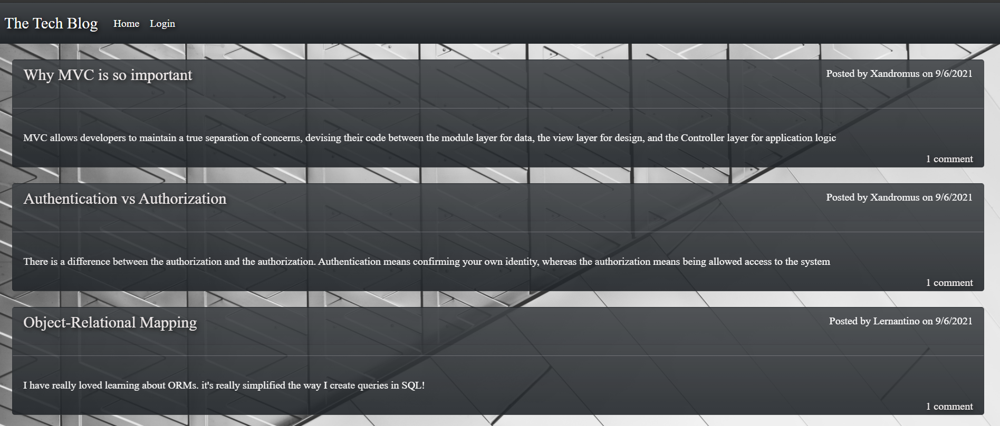
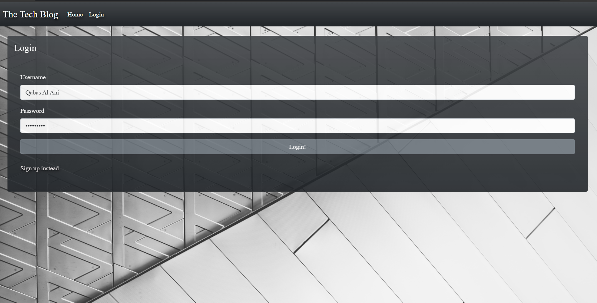
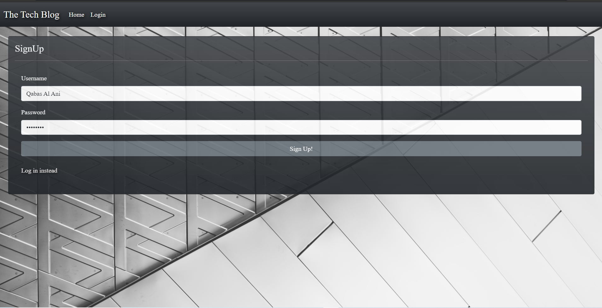
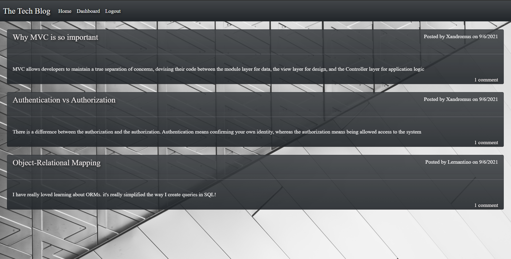
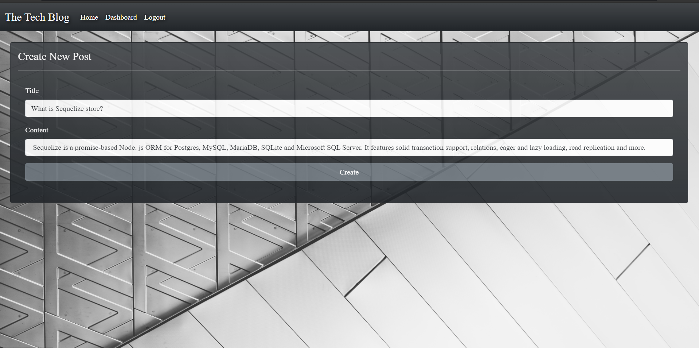
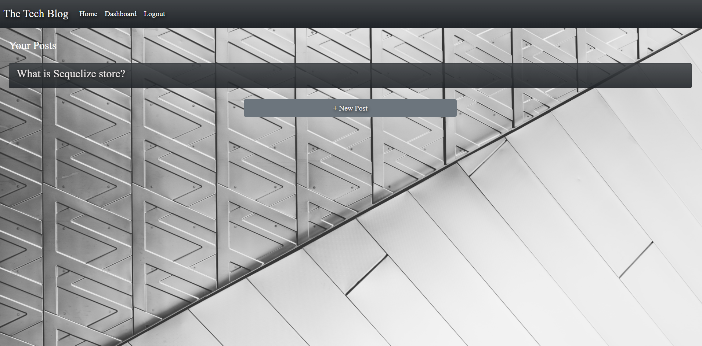
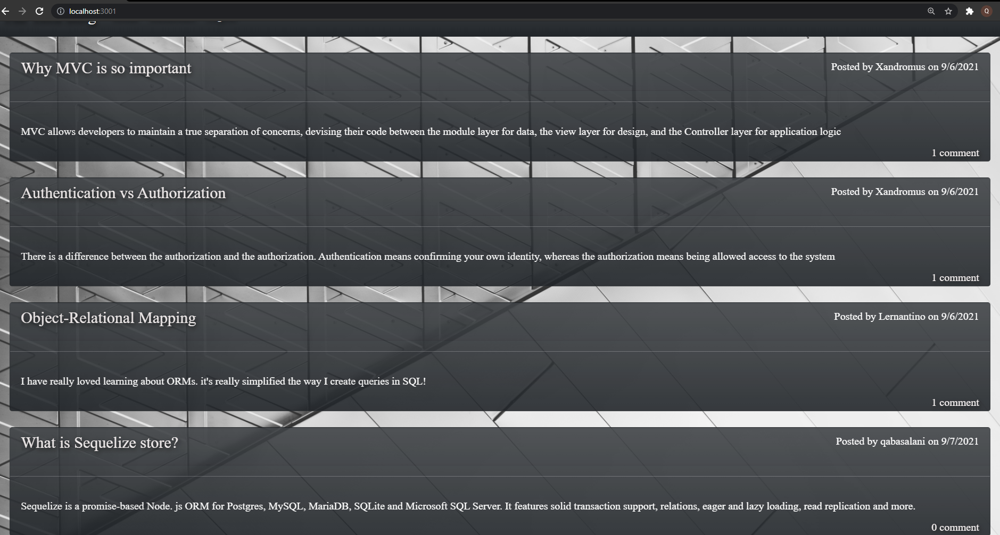
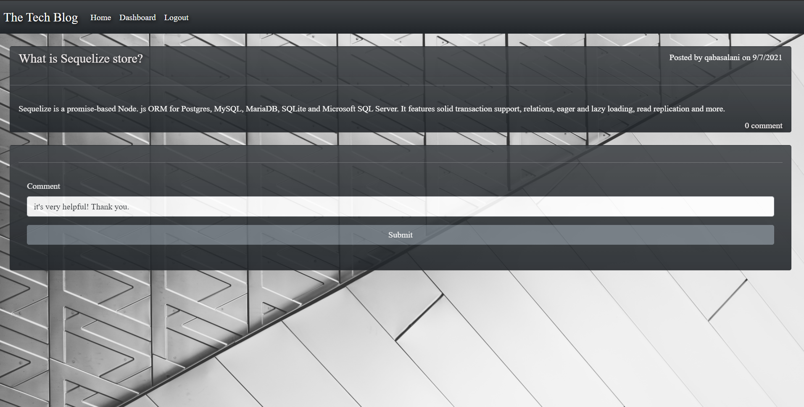

# The Tech Blog fullstack

---

[](https://opensource.org/licenses/MIT)

## Table of Contents

- [Description](#description)
- [Installation](#installation)
- [Technologies](#Technologies)
- [Usage](#usage)
- [Contribution](#contribution)
- [Test Instructions](#test-instructions)
- [Questions](#questions)

[Click here to view The Tech Blog Live! ]( https://serene-cove-48650.herokuapp.com/ )

## Description:

This is a back end and front end project that allows users to post about whatever they wish. It supports account creation with secure password hashing and storage as well as the ability to login They can also comment on posts if they are logged in. If the user idles for too long they will be logged out of their account The application contained within is a CMS-style blog site similar to a Wordpress site, where developers can publish their blog posts and comment on other developers’ posts as well.

## Technologies

```
- JavaScript.
- Css.
- Express.
- Sequelize.
- MySql2.
- MySql.
- SQL.
- Express-Session.
- Dotenv.
- Handlebars.
- Node.
- connect-session-sequelize.
- bcrypt.
- Heroku.
```

### Installation

```
npm install
```

### Usage

The developers can publish their blog posts and comment on other developers’ posts as well.


### Contribution

```
Contributions, issues, and feature requests are welcome!
Give a ⭐️ if you like this project!
```

### A Screenshot of my deployed The Tech Blog fullstack




















### Questions?

For any questions, please contact me with the information below:

doctorqa@yahoo.com

[LinkedIn Profile](https://www.linkedin.com/in/qabas-al-ani-7b858863/)

[Github Profile](https://github.com/Qabas-al-ani)
